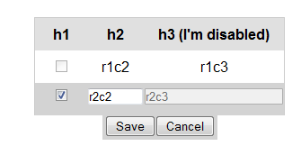
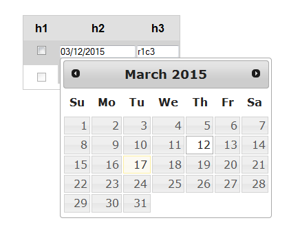
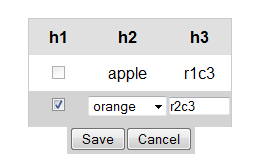

# editrowform
"A jquery plugin which allows you to edit each row of a table inline as a comprehensive form complete with a save and cancel button.  You can also use it to add or delete rows."

Usage:
Include the javascript and css file in your page.

Examples:
Take a look at the test directory for examples.  Below are some quick screen shots.

