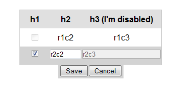
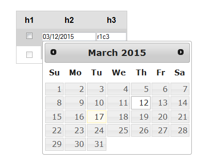
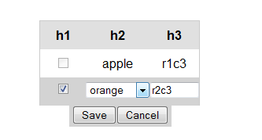
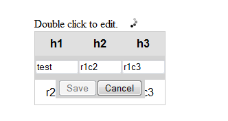

# editrowform
"A jquery plugin which allows you to edit each row of a table inline as a comprehensive form complete with a save and cancel button.  You can also use it to add or delete rows."

<h3>What's new?</h3>
Check the changelog.txt for a complete listing of changes in each version.

<h3>Usage:</h3>
Include the javascript and css file in your page.  The style sheet is pretty simple so override it to fit your needs.  It can also be used as an AMD module.

<h3>Where can I get it?</h3>
<ul>
	<li>GitHub - https://github.com/lsamaroo/editrowform</li>
	<li>NPM - https://www.npmjs.com/package/editrowform</li>
	<li>Bower</li>
</ul>

<h3>Want to build it?</h3>
You can use the minified file or source file as is.  But if you really 
want to build it, then follow the steps below.
$ npm install --global gulp  (you can skip this if you already have gulp installed)
 
$ npm install
 
$ gulp

<h3>Examples:</h3>
Take a look at the test directory for examples.  The following are currently available:

<ul>
	<li>A simple example showing check boxes and disabling a column</li>
	<li>A datepicker example</li>
	<li>A select dropdown example by overriding renderInput</li>
	<li>Saving with a ajax call</li>
	<li>Removing the save and cancel button and saving when the form gets hidden.</li>
	<li>An AMD example using require.js</li>
</ul>

Below are a couple of screen shots.

 

 

<h3>Like it?  Donate to the Lupus Research institute.</h3>
Donating to the Lupus Research Institute (LRI) makes a real difference in the fight against lupus. Help cure this devastating disease.
 
https://secure.lupusresearchinstitute.org/donate

<h3>API</h3>
<h5>Options</h5>

	/* 
	 * An id to use for the plugin, if empty one will be generated 
	 */
	id: "",
	
	
	/* 
	 * An optional css class to add to the plugin 
	 */
	cssClass: "",

		    		
	/* 
	 * True or false to turn on or off the double click and single click feature.  
	 * Defaults to true.
	 */
	click: true,
	
	
	/* 
	 * The text of the save button 
	 */
	saveText: "Save",
	
	
	/* 
	 * The text of the cancel button 
	 */
	cancelText: "Cancel",
	
	
	/* 
	 * A time in milliseconds to disable the save button when it's clicked
	 */
	saveButtonTimeout: "",
	
	 		
	/* 
	 * A time in milliseconds to disable the cancel button when it's clicked
	 */
	cancelButtonTimeout: "",
			    		

	/* 
	 * Hides the form when you click outside of the form or table.
	 * Defaults to true.
	 */
	hideOnBlur: true,
	
	
	/* 
	 * True to focus on the first input when the form is shown.
	 * Defaults to false.
	 */
	focusOnInput: false,
		
			
	/* 
	 * A array of column objects.  The column object has the same set of properties 
	 * as defined in the defaultColumn option below.  The defaultColumn option 
	 * list all the available properties that can be set. 
	 * 
	 * Note: If colIndex is not specified as a property, it will use the index 
	 * of this array as the colIndex.
	 * 
	 * Usage e.g. [  {id: "myid", colIndex:0, type: "checkbox"}, { colIndex:1, disabled: true} ]
	 */
	columns: "", 
	
	
	defaultColumn: {
		/* 
		 * The index of the column you want to set these properties for.
		 */
		colIndex: "",
		
		
		/* 
		 * If set, it is used as the id for input element for that column. 
		 * One is generated if left empty. 
		 */
		id: "",
		
		
		/* 
		 * If set, it is used as the name of the input element for that column.
		 * If empty, it will use the id.  If the id is not set then it will use the 
		 * header text.  Finally if that is not available, then it generates a name.
		 */
		name: "", 
		
		
		/* 
		 * The type of input to display on the form.
		 * Current supported options are: text, checkbox, datepicker.
		 */
		type: "", 
		
		
		/* 
		 * If true, it will render the input for that column as disabled 
		 */
		disabled: "",
		
		
		/* 
		 * Unlike disabled, ignore will simply not render any input 
		 * for the column when set to true.
		 */
		ignore: "", 
		
		/* 
		 * A default value to set the input to
		 */			
		defaultValue: ""		
	}
    		
    		
	onSave
		/* 
		 * Called when the save button is clicked.  Can be overridden to perform 
		 * your own save action.  
		 * 
		 * @example
		 * function(form, rowIndex, row, rowValues){}. 
		 * 
		 * @param form is the form element displayed by the plugin.
		 * @param rowIndex is the index of the row being edited.
		 * @param row is the row element being edited
		 * @param rowValues is an array of values entered into the form.  
		 * 
		 * @return false to stop the plugin from updating the row values 
		 * and hiding the dialog.  For example you may want to wait untill 
		 * after a ajax callback before updating the row.
		 * True to contine as normal.
		 */

    		
    		
	onCancel    		
		/* 
		 * Called when the cancel button is clicked.
		 * 
		 * @example
		 * function(form, rowIndex, row){}. 
		 * 
		 * @param form is the form element displayed by the plugin.
		 * @param rowIndex is the index of the row being edited.
		 * @param row is the row element being edited.
		 *  
		 * @return false to stop the save.  True to continue as normal.
		 */

	onHide
		/* 
		 * Triggered when the plugin form is hidden.  
	     * This callback will only trigger when the form goes from a 
	     * visible state to a hidden state. 
		 * 
		 * @example
		 * function(form, rowIndex, row){}. 
		 * 
		 * @param form is the form element.
		 * @param rowIndex is the index of the row being edited.
		 * @param row is the row element being edited. 
		 */
	
    		
    		
	onDeleteRow    		
		/* 
		 * Trigger when deleteRow is called.  Can be used to perform additional 
		 * task associated with deletion of a row.  For example you can override to
		 * have deletion gray out a row instead of actually deleting it.
		 * 
		 * @example
		 * function(rowIndex, row){}. 
		 * 
		 * @param rowIndex is the index of the row being deleted.
		 * @param row is the row element being deleted.
		 * 
		 * @return false to stop the plugin from removing the row from 
		 * the table.  True or empty to remove the row.
		 */

    		
    		
 	onAddRow   		
		/* 
		 * Called when addRow is called.  Can be used to perform additional
		 * task associated with adding the row. For example you can add 
		 * a css class to the row.
		 * 
		 * @example
		 * function(rowIndex, row){}. 
		 * 
		 * @param rowIndex is the index of the newly created row.
		 * @param row is the row element of the newly created row.
		 * 
		 * @return false to stop the plugin from adding the row to the table.  
		 * True or empty to continue as normal.
		 */

    		
 	getCellValue   			
		/* 
		 * Override to return your own interpretation of what the cell 
		 * value should be.  By default it will read the text from the td element (cell).
		 * 
		 * @example
		 * function(rowIndex, colIndex, computedValue, row, cell){} 
		 * 
		 * @param rowIndex is the row index of the row.
		 * @param colIndex is the column index of the column.
		 * @param computedValue is the value the plugin extracted from the cell.
		 * @param row is the row element the cell is in.
		 * @param cell is the cell element.
		 */

    		
    		
 	setCellValue   				    		
		/* 
		 * Override this to get complete control of how the cell value 
		 * should be set on the table.
		 * 
		 * @example
		 * function(rowIndex, colIndex, value, row, cell){} 
		 * 
		 * @param rowIndex is the row index of the row.
		 * @param colIndex is the column index of the column.
		 * @param value is the value being set to the cell.
		 * @param row is the row element the cell is in.
		 * @param cell is the cell element.
		 */   		

    		
    		
	getInputValue    			    		
		/* 
		 * Override this to determine the value the plugin gets from 
		 * the form input.                    
		 * 
		 * @example
		 * function(rowIndex, colIndex, computedValue, inputId, form, row, cell, header){} 
		 * 
		 * @param rowIndex is the row index of the row.
		 * @param colIndex is the column index of the column.
		 * @param computedValue is the value the plugin extracted from the input.
		 * @param inputId is the id of the input.
		 * @param form is the form element.
		 * @param row is the row element.
		 * @param cell is the cell element.
		 * @param header is the header element.
		 * 
		 * @return a value from the input.
		 */    

    		
    		
	setInputValue    				    		
		/* 
		 * Override to determine how the plugin sets the value of the plugin.
		 * 
		 * @example
		 * function( rowIndex, colIndex, value, inputId, form, row, cell, header ){} 
		 * 
		 * @param rowIndex is the row index of the row.
		 * @param colIndex is the column index of the column.
		 * @param value is the value being set.
		 * @param inputId is the id of the input.
		 * @param form is the form element.
		 * @param row is the row element.
		 * @param cell is the cell element.
		 * @param header is the header element.
		 */

    		
    		
	renderInput	    				    		
		/* 
		 * Override to render your own custom input.  For example you can 
		 * override this to return a select element for a specific column.
		 * 
		 * @example
		 * function(input, rowIdex, colIndex, header ){} 
		 * 
		 * @param input is the input element the plugin created to add to the form.
		 * @param rowIndex is the index of the row.
		 * @param colIndex is the index of the column.
		 * @param header is the header element
		 * 
		 * @return a form element to display on the edit form.
		 */

 
<h5>Public Methods</h5>

	save
        /**
         * Saves the input to the table and hides the dialog.
         * 
         * @example
         * .editrowform( "save" )
         */

	        
	addRow
        /* 
         * Add a row to the table. 
         * If templateRow is passed in, it will use that to add the row.  
         * Otherwise it will create a new row.
         *  
         * @example
         * .editrowform( "addRow", templateRow )
         * 
         * @param templateRow is an optional argument. It can be
         * a dom element or string representing a row or a function
 			* which return a row to add.
	        * 
	        * For backward compatibility if left empty or set to true, it will still   
	        * attempt to clone an the existing last row.  In future releases
	        * this will be removed.
	        * 
	        * @return the rowIndex of the newly created row or false if the 
	        * function call did not add the row.
	        */	   
         
			
	deleteRow			
        /* 
         * Remove the indicated row from the table.  This will remove it 
         * from the table DOM. 
         *
         * @example
         * .editrowform( "deleteRow", rowIndex )
         *  
         * @param rowIndex is the row index to perform the operation on.
         */

	        
	setRowValues
        /* 
         * Set the value for the given row index.  Takes an array of values.
         *
         * @example
         * .editrowform( "setRowValues", rowIndex, rowValues )
         *  
         * @param rowIndex is the row index to set the values for.
         *  
         * @param rowValues is an array of values to set for the row.  The index 
         * of the array corresponds to the column index.   
         */

			
	show				
		/* 
		 * Shows the edit form for the specified row.  Does nothing for invalid row index.
		 * 
        * @example
        * .editrowform( "show", rowIndex )
		 * 
		 * @param rowIndex is the row index to show the form for.
		 */
		 
			
	hide			
		/* 
		 * Hides the edit form if it is currently visible. 
		 * 
        * @example
        * .editrowform( "hide" )
		 * 
		 */

			
	destroy			
		/* 
		 * Remove the plugin from the DOM and cleanup.
		 * 
        * @example
        * .editrowform( "destroy")
		 * 
		 */
			
			
	getRowCount			
		/* 
		 * Get the number of rows in the table.
		 * 
        * @example
        * .editrowform( "getRowCount" )
        * 
        * @return the number of rows in the table associated with this plugin
		 */

			
	getColumnCount				
		/* 
		 * Get the number of columns in the table.
		 * 
        * @example
        * .editrowform( "getColumnCount" )
        * 
        * @return the number of columns in the table associated with this plugin
		 */
		 
		 
	getForm	 
		/* 
		 * Get the form created by this plugin.
		 * 
        * @example
        * .editrowform( "getForm" )
        * 
        * @return the form object created by this plugin
        * 
		 */
	 
