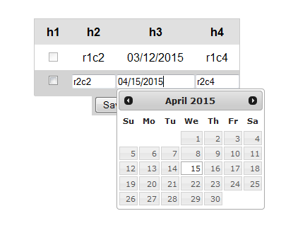

# editrowform
"A jquery plugin which allows you to edit each row of a table inline as a comprehensive form complete with a save and cancel button.  You can also use it to add or delete rows."

<h3>What's new?</h3>
Check the changelog.txt for all the changes in each version.

 
<b>
Important!!! v1.2.5 has a change to the onSave and onCancel options that's not backwards compatible.  The first argument to these callback functions (the event object) has been removed.  This was to facilitate making the "save" function public.
</b>

<h3>Usage:</h3>
Include the javascript and css file in your page.  The stylesheet is pretty simple so overide it to fit your needs.

<h3>Examples:</h3>
Take a look at the test directory for examples.  The following are currently available:

<ul>
	<li>A simple example showing checkboxes and disabling a column</li>
	<li>A datepicker example</li>
	<li>A select dropdown example by overriding renderInput</li>
	<li>Saving with a ajax call</li>
</ul>

Below are a couple of screen shots.

 

<h3>API</h3>
<h5>Options</h5>
	    		/* 
	    		 * An id to use for the plugin, if empty one will be generated 
	    		 */
	    		id: "",
	    		
	    		
	    		/* 
	    		 * An optional css class to add to the plugin 
	    		 */
	    		cssClass: "",

	    			    		
	    		/* 
	    		 * True or false to turn on or off the double click and single click feature.  Defaults to true.
	    		 */
	    		click: true,
	    		
	    		
	    		/* 
	    		 * The text of the save button 
	    		 */
	    		saveText: "Save",
	    		
	    		
	    		/* 
	    		 * The text of the cancel button 
	    		 */
	    		cancelText: "Cancel",
	    		
	    		
	    		/* 
	    		 * A time in milliseconds to disable the save button when it's clicked
	    		 */
	    		saveButtonTimeout: "",
	    		
	    		 		
	    		/* 
	    		 * A time in milliseconds to disable the cancel button when it's clicked
	    		 */
	    		cancelButtonTimeout: "",
	    				    		
	    		
	    		/* 
	    		 * A array of column objects.  The column object has the same set of properties as defined in 
	    		 * the defaultColumn option below.  The defaultColumn option list all the available properties
	    		 * that can be set on the column. 
	    		 * 
	    		 * Note: If colIndex is not specified as a property, it will use the index of this array as the colIndex.
	    		 * 
	    		 * Usage e.g. [  {id: "myid", colIndex:0, type: "checkbox"}, { colIndex:1, disabled: true} ]
	    		 *
	    		 */
	    		columns: "", 
	    		
	    		
	    		defaultColumn: {
	    			/* 
	    			 * The index of the column you want to set these properties for.
	    			 */
	    			colIndex: "",
	    			
	    			
	    			/* 
	    			 * If set, it is used as the id for input element for that column. An id is generated if  empty. 
	    			 */
	    			id: "",
	    			
	    			
	    			/* 
	    			 * If set, it is used as the name of the input element for that column.
	    			 * If empty, it will use the header text.  If that is not available, then it generates a name.
	    			 */
	    			name: "", 
	    			
	    			
	    			/* 
	    			 * The type of input to display on the form.
	    			 * Current supported options are: text, checkbox, datepicker.
	    			 * 
	    			 */
	    			type: "", 
	    			
	    			
	    			/* 
	    			 * If true, it will render the input for that column as disabled 
	    			 */
	    			disabled: "",
	    			
	    			
	    			/* 
	    			 * Unlike disabled, ignore will simply not render any input for the column when set to true.
	    			 */
	    			ignore: "", 
	    		},
	    		
	    		
	onSave
	    		/* 
	    		 * Called when the save button is clicked.  Can be overridden to perform your own save 
	    		 * action.  
	    		 * 
	    		 * @example
	    		 * function(form, rowIndex, row, rowValues){}. 
	    		 * 
	    		 * @param form is the form element displayed by the plugin.
	    		 * @param rowIndex is the index of the row being edited.
	    		 * @param row is the row element being edited
	    		 * @param rowValues is an array of values entered into the form.  It's the values of all the input elements in the form.
	    		 * 
				 * @return false to stop the plugin from updating the row values and hiding the dialog.
	    		 * For example you may want to wait untill after a ajax callback and manually update the row 
	    		 * instead of having the plugin do it.
	    		 * 
	    		 */

	    		
	    		
	onCancel    		
	    		/* 
	    		 * Called when the cancel button is clicked.
	    		 * 
	    		 * @example
	    		 * function(form, rowIndex, row){}.
	    		 * 
	    		 * @param form is the form element displayed by the plugin.
	    		 * @param rowIndex is the index of the row being edited.
	    		 * @param row is the row element being edited
	    		 *  
	    		 * @return false to stop the save.  True to continue as normal.
	    		 *
	    		 */

	    		
	    		
	onDeleteRow    		
	    		/* 
	    		 * 
	    		 * Called when deleteRow is called.  Can be used to perform additional task associated with deletion of a row.
	    		 * For example you can gray out the row instead of removing it from the table when delete is called.
	    		 * 
	    		 * @example
	    		 * function(rowIndex, row){}. 
	    		 * 
	    		 * @param rowIndex is the index of the row being deleted.
	    		 * @param row is the row element being deleted.
	    		 * 
	    		 * @return false to stop the plugin from removing the row from the table.  True or empty to remove the row.
	    		 * 
	    		 */

	    		
	    		
	 onAddRow   		
	    		/* 
	    		 * Called when addRow is called.  Can be used to perform additional task associated with adding the row.
	    		 * For example you can add a css class to the row.
	    		 * 
	    		 * @example
	    		 * function(rowIndex, row){}. 
	    		 * 
	    		 * @param rowIndex is the index of the newly created row.
	    		 * @param row is the row element of the newly created row.
	    		 * 
	    		 * @return false to stop the plugin from adding the row to the table.  True or empty to continue with the add.
	    		 * 
	    		 */

	    		
	 getCellValue   			
	    		/* 
	    		 * 
	    		 * Override to return your own interpretation of what the cell value should be.  By default it will read the text
	    		 * from the td element (cell).
	    		 * 
	    		 * @example
	    		 * function(rowIndex, colIndex, computedValue, row, cell){} 
	    		 * 
	    		 * @param rowIndex is the row index of the row.
	    		 * @param colIndex is the column index of the column.
	    		 * @param computedValue is what the value the plugin extracted from the cell.
	    		 * @param row is the row element the cell is in.
	    		 * @param cell is the cell element.
	    		 * 
	    		 */

	    		
	    		
	 setCellValue   				    		
	    		/* 
	    		 * Override this to get complete control of how the cell value should be set on the table.
	    		 * 
	    		 * @example
	    		 * function(rowIndex, colIndex, value, row, cell){} 
	    		 * 
	    		 * @param rowIndex is the row index of the row.
	    		 * @param colIndex is the column index of the column.
	    		 * @param value is the value being set to the cell.
	    		 * @param row is the row element the cell is in.
	    		 * @param cell is the cell element.
	    		 * 
	    		 */   		

	    		
	    		
	getInputValue    			    		
	    		/* 
	    		 * Override this to control how the plugin gets the value from the input elements in the form.
	    		 * 
	    		 * @example
	    		 * function(rowIndex, colIndex, computedValue, inputId, form, row, cell, header){} 
	    		 * 
	    		 * @param rowIndex is the row index of the row.
	    		 * @param colIndex is the column index of the column.
	    		 * @param computedValue is the value the plugin extracted from the input.
	    		 * @param inputId is the id of the input.
	    		 * @param is the form element.
	    		 * @param row is the row element.
	    		 * @param cell is the cell element.
	    		 * @param header is the header element.
	    		 * 
	    		 * @return a value from the input.
	    		 * 
	    		 */   

	    		
	    		
	setInputValue    				    		
	    		/* 
	    		 * Override to determine how the plugin sets the value of the plugin.
	    		 * 
	    		 * @example
	    		 * function( rowIndex, colIndex, value, inputId, form, row, cell, header ){} 
	    		 * 
	    		 * @param rowIndex is the row index of the row.
	    		 * @param colIndex is the column index of the column.
	    		 * @param value is the value being set.
	    		 * @param inputId is the id of the input.
	    		 * @param is the form element.
	    		 * @param row is the row element.
	    		 * @param cell is the cell element.
	    		 * @param header is the header element.
	    		 * 
	    		 */

	    		
	    		
	renderInput	    				    		
	    		/* 
	    		 * Override to render your own custom input.  For example you can override this to return a
	    		 * select element for a specific column.
	    		 * 
	    		 * @example
	    		 * function(input, rowIdex, colIndex, header ){} 
	    		 * 
	    		 * @param input is the input element the plugin created to add to the form.
	    		 * @param rowIndex is the index of the row.
	    		 * @param colIndex is the index of the column.
	    		 * @param header is the header element
	    		 * 
	    		 * @return a form element to display on the edit form.
	    		 */

<h5>Public Methods</h5>

	save
		        /**
		         * Saves the input to the table and hides the dialog.
		         * 
		         * @example
		         * .editrowform( "save" )
		         * 
		         */

		        
	addRow
		        /* 
		         * Add a row to the table. In order to create the new row, it clones the last row of the table. If none exists, it will 
		         * create a brand new row.
		         *  
		         * @example
		         * .editrowform( "addRow", cloneExisting )
		         * 
		         * @param cloneExisting is an optional argument which default to true.  It will clone an existing row from the 
		         * table (the last one) to create a new row.  If false, it will create a brand new row.
		         * 
		         * @return the rowIndex of the newly created row or false if the function call did not add the row.
		         *
		         * 
		         */	        

				
	deleteRow			
		        /* 
		         * Remove the indicated row from the table.  This will remove it from the table DOM. 
		         *
		         * @example
		         * .editrowform( "deleteRow", rowIndex )
		         *  
		         * @param rowIndex is the row index to perform the operation on.
		         *   
		         */

		        
	setRowValues
		        /* 
		         * Set the value for the given row index.  Takes an array of values.
		         *
		         * @example
		         * .editrowform( "setRowValues", rowIndex, rowValues )
		         *  
		         * @param rowIndex is the row index to set the values for.
		         *  
		         * @param rowValues is an array of values to set for the row.  The index of the array corresponds to the column index.
		         *   
		         */

				
	show				
				/* 
				 * 
				 * Shows the edit form for the specified row.  If the row index is not valid, it will not do nothing.
				 * 
		         * @example
		         * .editrowform( "show", rowIndex )
				 * 
				 * @param rowIndex is the row index to show the form for.
				 * 
				 */

				
	hide			
				/* 
				 * Hides the edit form if it is currently visible. 
				 * 
		         * @example
		         * .editrowform( "hide" )
				 * 
				 */

				
	destroy			
				/* 
				 * Remove the plugin from the DOM and cleanup.
				 * 
		         * @example
		         * .editrowform( "destroy")
				 * 
				 */
				
				
	getRowCount			
				/* 
				 * Get the number of rows in the table.
				 * 
		         * @example
		         * .editrowform( "getRowCount" )
		         * 
		         * @return the number of rows in the table associated with this plugin
				 * 
				 */

				
	getColumnCount				
				/* 
				 * Get the number of columns in the table.
				 * 
		         * @example
		         * .editrowform( "getColumnCount" )
		         * 
		         * @return the number of columns in the table associated with this plugin
				 * 
				 */
